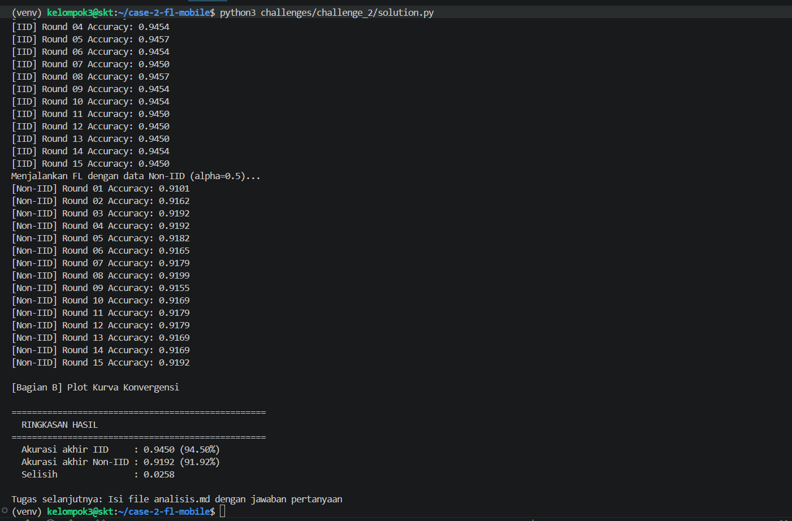
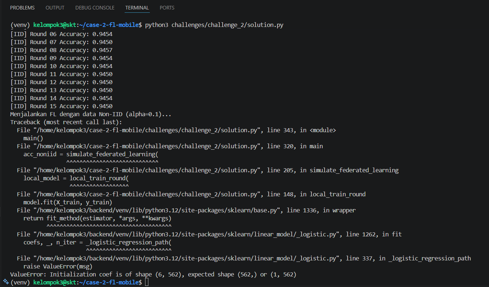
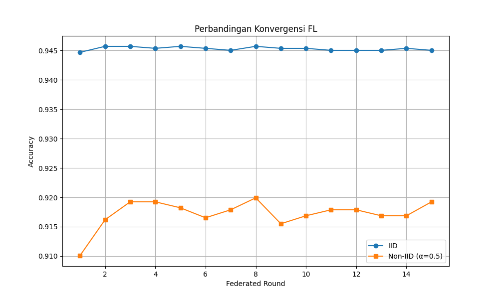

# Template Analisis — Challenge 2

**Nama Mahasiswa** : ___________________________  
**NIM**            : ___________________________  
**Tanggal**        : ___________________________

---

## Pertanyaan 1

**Mengapa akurasi model FL pada data Non-IID lebih rendah atau lebih lambat
konvergen dibandingkan data IID?**

*Jawaban:*

> Pada data IID, distribusi label pada setiap client relatif seimbang sehingga model lokal mempelajari pola data yang mirip. Akibatnya, update parameter dari tiap client cenderung konsisten dan proses Federated Averaging dapat menghasilkan model global yang lebih stabil.
>
> Sedangkan pada data Non-IID, distribusi label antar client berbeda-beda. Berdasarkan hasil eksperimen, beberapa client memiliki label yang sangat dominan seperti LAYING atau STANDING. Hal ini menyebabkan model lokal belajar pola yang berbeda sehingga update parameter antar client sering saling bertentangan saat proses agregasi dilakukan.
>
> Akibatnya, model global menjadi lebih lambat konvergen dan akurasi akhirnya lebih rendah dibandingkan kondisi IID. Pada eksperimen yang dilakukan, akurasi akhir IID juga terlihat lebih tinggi dibanding Non-IID.
>
> Referensi:
> - Zhao, Y., et al. (2018). *Federated Learning with Non-IID Data*.
> - Li, T., et al. (2020). *Federated Optimization in Heterogeneous Networks (FedProx)*.
---

## Pertanyaan 2

**Apa yang terjadi pada proses training FL jika alpha sangat kecil (misalnya α = 0.01)?
Berikan analisis berdasarkan hasil eksperimen Anda.**

*Jawaban:*

> 
>
> 
>
> Saat alpha diperkecil menjadi α = 0.1, distribusi data antar client menjadi jauh lebih tidak seimbang dibanding α = 0.5. Pada hasil eksperimen terlihat beberapa client memiliki label yang sangat dominan, misalnya hampir seluruh data pada client tertentu berisi aktivitas laying atau standing.
>
> Kondisi ini membuat model lokal menjadi lebih bias terhadap data masing-masing client sehingga update parameter antar client semakin berbeda saat proses Federated Averaging dilakukan.
>
> Selain itu, training juga menjadi kurang stabil karena beberapa client memiliki variasi label yang sangat sedikit. Hal ini menunjukkan bahwa semakin kecil nilai alpha, semakin tinggi heterogenitas data dan semakin sulit proses training Federated Learning.
---

## Pertanyaan 3

**Sebutkan 2 teknik yang dapat meningkatkan performa FL pada data Non-IID.
Jelaskan ide dasar masing-masing teknik.**

*Jawaban:*

> **Teknik 1**: FedProx
>
> FedProx merupakan pengembangan dari FedAvg yang menambahkan proximal term pada proses training lokal agar parameter model client tidak terlalu jauh menyimpang dari model global. Teknik ini membantu mengurangi masalah client drift pada data Non-IID sehingga training menjadi lebih stabil dan konvergensi model menjadi lebih baik.
>
>Referensi:
>Li, T., et al. (2020). Federated Optimization in Heterogeneous Networks (FedProx).
>
> **Teknik 2**: SCAFFOLD
>
>SCAFFOLD menggunakan control variates untuk mengoreksi arah update dari masing-masing client selama training lokal. Dengan pendekatan ini, perbedaan distribusi data antar client dapat dikurangi sehingga proses training pada data Non-IID menjadi lebih stabil dan efisien.
>
>Referensi:
>Karimireddy, S. P., et al. (2020). SCAFFOLD: Stochastic Controlled Averaging for Federated Learning.
---

## Hasil Eksperimen

| Metrik | IID | Non-IID (α=0.5) |
|--------|-----|-----------------|
| Akurasi Round 1 | 0.9447 | 0.9101 |
| Akurasi Round 5 | 0.9457 | 0.9182 |
| Akurasi Round 10 | 0.9454 | 0.9169 |
| Akurasi Final | 0.9450 | 0.9192 |
| Round hingga acc > 0.8 | Round 1 | Round 1 |

*Lampirkan screenshot grafik konvergensi.*

