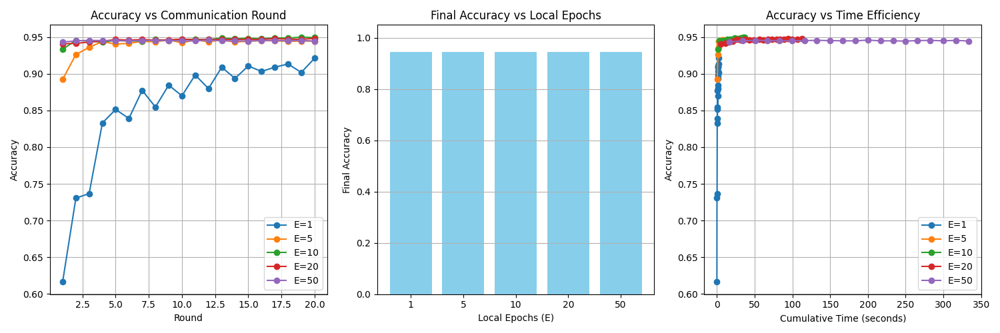
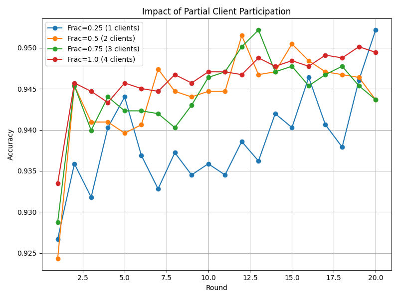

# Laporan Challenge 4: Analisis Konvergensi & Efisiensi Komunikasi

**Nama:** Sandhika Rizqi Ramadhan  
**NIM:** 235150200111019  
**Tanggal:** 18/05/2026

---

## 1. Penjelasan Implementasi Kode (`solution.py`)

Pada *Challenge 4*, simulasi *Federated Learning* (FL) diimplementasikan secara terpusat di dalam file `solution.py` menggunakan *library* `scikit-learn` dan algoritma `LogisticRegression`. Berikut adalah alur logika yang diimplementasikan pada fungsi `run_fl_experiment`:

1. **Inisialisasi Model Global**: Model global diinisialisasi dengan bobot (`coef`) dan bias (`intercept`) bernilai nol.
2. **Seleksi Client (Partial Participation)**: Pada setiap *round* komunikasi, tidak semua *client* melakukan komputasi. Hanya sebagian *client* yang dipilih secara acak menggunakan probabilitas `client_fraction` untuk merepresentasikan skenario *real-world* di mana *device mobile* mungkin sedang *offline* atau kehabisan baterai.
3. **Training Lokal (Local Epochs - $E$)**: *Client* yang terpilih akan mengunduh bobot dari model global, lalu melatih modelnya masing-masing menggunakan datanya sendiri. Batas waktu/banyaknya iterasi belajar dibatasi oleh parameter `local_epochs` ($E$).
4. **Agregasi FedAvg**: Setelah *training* lokal selesai, bobot (parameter) dari setiap *client* dikumpulkan dan di-rata-ratakan (Federated Averaging) secara proporsional berdasarkan jumlah data (`weights`) yang dimiliki tiap *client*.
5. **Evaluasi**: Model global yang baru hasil agregasi kemudian diuji menggunakan data *testing* gabungan untuk mencatat akurasi per-*round*.

---

## 2. Bagian A — Analisis Konvergensi (Pengaruh Local Epochs)

Eksperimen pertama bertujuan untuk melihat bagaimana jumlah *local epochs* ($E$) memengaruhi kecepatan konvergensi (seberapa cepat model menjadi pintar) dan efisiensi waktu komputasi.

**Hasil Analisis:**
1. **Kasus $E = 1$ (Terlalu Sedikit)**: 
   Jika *client* hanya belajar 1 iterasi per *round* sebelum mengirim model ke server, akurasi naik dengan sangat lambat. Hal ini akan menuntut jumlah *round* komunikasi yang jauh lebih banyak. Dalam konteks jaringan *mobile*, **hal ini sangat tidak efisien** karena membuang banyak *bandwidth* dan kuota internet untuk proses pertukaran data (komunikasi).
2. **Kasus $E = 50$ (Terlalu Banyak)**: 
   Jika *client* belajar hingga 50 iterasi per *round*, akurasi memang langsung tinggi dari *round* pertama. Namun, jika dilihat pada grafik **"Accuracy vs Time Efficiency"**, titik ungunya menjuntai sangat jauh ke kanan. Artinya, proses komputasi lokal memakan waktu dan sumber daya *hardware* yang sangat masif. Di perangkat *mobile*, ini akan menyebabkan **baterai cepat habis (drain) dan *overheating***.
3. **Nilai $E$ Optimal**: 
   Berdasarkan eksperimen, **nilai optimal adalah $E = 5$ atau $E = 10$**. Pada konfigurasi ini, keseimbangan *trade-off* terbaik tercapai: model konvergen dalam beberapa *round* awal tanpa membebani daya komputasi perangkat *mobile* secara berlebihan.

---

## 3. Bagian B — Analisis Partial Client Participation

Eksperimen kedua menyimulasikan sistem FL terdistribusi di mana jumlah klien yang berpartisipasi (*online*) dibatasi dalam setiap *round*-nya.

**Hasil Analisis:**
- **Fraction 0.25 (1 Client)**: Garis biru pada grafik menunjukkan volatilitas (naik-turun) yang sangat ekstrem dari 93% hingga 95%. Hal ini terjadi karena agregasi `FedAvg` hanya mengambil informasi dari satu partisipan secara acak per *round*, sehingga model global cenderung menjadi bias terhadap data orang tersebut saja (*overfitting* lokal parsial).
- **Fraction Minimal untuk Stabilitas**: Kestabilan mulai terlihat pada **Fraction 0.5 (2 Clients)** yang diwakili oleh garis oranye. Pada fraksi ini, fluktuasi mereda dan model secara konsisten beradada di sekitar akurasi 94.5%.
- **Kesimpulan**: Untuk menjaga performa model konvergen dan stabil, FL tidak butuh 100% *client online*. Minimal **50% partisipasi (2 dari 4 client)** sudah cukup menstabilkan pembelajaran, sekaligus menghemat *overhead* jaringan server hingga 50% dibandingkan jika semua *client* diwajibkan mengirim data.

---

## Kesimpulan Akhir
Berdasarkan eksperimen pada Challenge 4 ini, konfigurasi terbaik untuk menjaga keseimbangan antara **Privasi, Efisiensi Komputasi (Baterai), dan Efisiensi Komunikasi (Bandwidth)** pada kasus *Mobile Activity Recognition* adalah:
1. Menggunakan **$E = 5$ hingga $E = 10$** untuk meminimalisasi *round* komunikasi tanpa menyiksa baterai ponsel.
2. Menerapkan toleransi partisipasi minimal **50% fraction** (*client drop-out* diizinkan) guna menghemat *resource* *bandwidth* server FL dengan pengorbanan akurasi yang dapat diabaikan.
